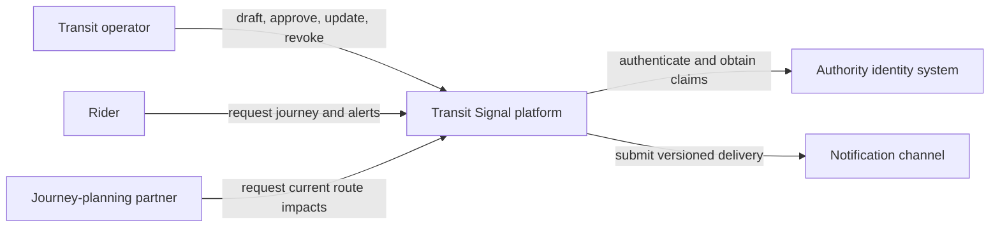

# Worked Case Study: Transit Signal

## How to use this case

Transit Signal is the continuing non-capstone example for Module 1. Follow each
step after reading the related lesson. The case demonstrates a reasoning method,
not a canonical architecture. Other designs can be defensible under different
workloads, constraints, or ownership.

Do not substitute the commerce capstone into the worked steps. Complete the
guided exercises first, then produce the commerce artifacts independently.

## Step 1: Replace the solution request with an outcome

### Initial request

> Build a modern real-time, cloud-native transit alerting system with
> microservices and event streaming.

This statement chooses labels before establishing the problem.

### Framed outcome

> When service changes affect a rider’s intended route, the rider receives the
> current operator-approved impact early enough to choose another route. Transit
> operations can correct or revoke an alert without an old version remaining
> authoritative.

### Primary journeys

1. An operator drafts, reviews, and approves a route-impact alert.
2. A rider planning a trip sees current impacts.
3. A rider already traveling receives a relevant notification.
4. An operator updates or revokes incorrect information.
5. An incident lead reconstructs who changed an alert and why.

### Business outcomes

- Reduce disruption-related journey abandonment from an assumed 12% to below
  8% during the pilot, subject to validating the measurement.
- Make 99% of approved alert versions observable to eligible rider views within
  two minutes over a rolling 28-day window.
- Make revoked versions ineligible for new rider views within one minute.

The first target is a product hypothesis. The second and third are service
behavior targets.

## Step 2: Set scope and non-goals

### In scope

- Operator drafting, approval, update, revocation, and expiry
- Current alert lookup by route and journey
- Versioned notification delivery
- Audit history
- Derived channel reconciliation

### Non-goals

- Predicting disruptions from vehicle telemetry
- Replacing the journey-planning engine
- Managing operator employment or regional assignments
- Guaranteeing telecom delivery to an offline device

### Constraints

- Use the authority’s existing operator identity and regional assignments.
- Pilot launches in sixteen weeks with one eight-person engineering team.
- Existing journey planner consumes a versioned route-impact interface.
- Pilot data remains in the current legal region.
- The existing on-call group operates the result; no new specialist rotation.

### Assumptions

| Assumption | Confidence | Consequence if false | Test |
|---|---|---|---|
| At most 200 operators active concurrently | Medium | Approval workload and support model change | Identity audit |
| A citywide disruption creates a five-minute read burst | Low | Peak rate estimate changes materially | Analyze current web traffic |
| Notification acceptance can be retried with stable identity | Medium | Delivery semantics need adapter-specific handling | Channel contract test |
| One regional team owns pilot operations | High | Deployment and incident boundaries may change | Confirm operating model |

## Step 3: Model the workload

| Dimension | Normal | Peak | Burst | 18-month projection | Basis |
|---|---:|---:|---:|---:|---|
| Alert-view reads | 60/s | 170/s | 800/s for 5 min | 1,200/s burst | Planning model |
| Approved changes | 2/min | 10/min | 40/min | 60/min | Incident estimate |
| Draft edits | 8/min | 25/min | 80/min | 120/min | Operator estimate |
| Subscribers per alert | 5k | 50k | 1.2m | 1.8m | Route skew assumption |
| Alert payload | 1.5 KiB | 2 KiB | 4 KiB | 4 KiB | Sample content |
| Retained versions | 50k/year | same | same | 90k/year | Retention estimate |

### Sensitivity

Burst rate changes most with:

1. The percentage of riders checking during the busiest five minutes.
2. Whether clients poll after receiving a notification.
3. One-route or citywide concentration.

The design must not treat 800 reads/second as measured capacity evidence.

## Step 4: State invariants

| ID | Invariant | Threatening event | Proof idea |
|---|---|---|---|
| T-INV-01 | At most one alert version is current for a route and effective interval | Concurrent approval | Race expected versions |
| T-INV-02 | A revoked version is never authoritative for a new rider view | Stale derived copy | Reconcile source version |
| T-INV-03 | An approval request identity creates at most one authoritative approved version | Lost response and retry | Replay same identity |
| T-INV-04 | Alert transitions follow Draft → Approved → Revoked/Expired or Approved → Updated | Direct state mutation | Transition-property tests |
| T-INV-05 | Only an authorized operator for the region may approve or revoke | Stale or forged claims | Object/action authorization tests |
| T-INV-06 | Every authoritative transition has actor, prior version, reason, and time | Audit write failure | Reject incomplete transition |
| T-INV-07 | Delivery replay cannot create a second authoritative alert version | Backlog recovery | Replay all delivery work |
| T-INV-08 | Derived channels can be rebuilt from authoritative version history | Lost derived state | Empty and rebuild channel view |
| T-INV-09 | Restore cannot make a superseded version current | Old backup restore | Restore then reconcile versions |
| T-INV-10 | A route identifier in an approved alert references a route valid for its effective interval | Route change | Validate versioned route reference |
| T-INV-11 | A regional operator cannot read private drafts outside their region | Cross-region request | Authorization matrix test |
| T-INV-12 | Alert expiry does not delete required audit history | Retention cleanup | Cleanup and audit query |

## Step 5: Define quality scenarios

| Attribute | Scenario |
|---|---|
| Performance | When a rider requests an affected journey during the morning peak, the journey view returns current route-impact information, with 95% completing within 300 ms and 99% within 1 s as measured at the client over 28 days. |
| Freshness | When an operator approves a version during peak operation, eligible rider views observe it within 2 minutes for 99% of versions and within 5 minutes for 99.9% over 28 days. |
| Overload | When alert-view traffic reaches 10× normal for five minutes, authoritative operator transitions remain accepted, rider work stays bounded, and rejected/degraded views identify retry behavior; no unbounded queue is permitted. |
| Availability | When one notification channel is unavailable for 15 minutes, rider views continue from authoritative state with 99% successful eligible requests during the incident. |
| Recovery | When the delivery worker is unavailable for 15 minutes during a citywide alert, delivery resumes without duplicate authoritative effects and clears the eligible backlog within 30 minutes. |
| Security | When an authenticated operator attempts to approve an alert outside their assigned region, every attempt is denied and audited; one unauthorized success fails the invariant. |

## Step 6: Draw context and ownership

| Business fact | Authority | Derived consumers | Repair |
|---|---|---|---|
| Current alert version | Alert approval | Journey views, partner feed, channels | Rebuild by highest effective source version |
| Operator regional authority | Existing identity system | Approval checks | Refresh claims; deny when authority cannot be established |
| Journey route | Journey-planning partner | Transit Signal lookup | Versioned interface refresh |
| Delivery status | Channel delivery responsibility | Operations dashboard | Reconcile delivery identity and source version |

## Step 7: Rank drivers and compare candidates

### Drivers

1. Preserve version and regional-authority invariants.
2. Keep slow notification channels off approval and rider-read critical paths.
3. Meet burst and freshness scenarios.
4. Fit one team’s delivery and on-call capacity.
5. Permit channel replacement.
6. Remain within the pilot cost envelope.

### Cost envelope

- No more than sixteen calendar weeks and one eight-person team for the pilot.
- No new 24×7 specialist rotation.
- Recurring cost target: under $0.002 per useful alert view at projected burst,
  to be validated after measurement.
- Rollback within one release window without reconstructing authoritative
  history.

### Candidate A: Simple

One deployable application owns authoring, approval, rider reads, and an internal
bounded delivery queue.

- Best for one-team delivery and one authoritative transition.
- Risk of shared resource interference from slow channels.
- Requires a load and dependency-slowdown experiment.

### Candidate B: Moderate

One application owns authoring, approval, and rider reads. An independently
scalable worker consumes versioned delivery intents and reconciles from
authoritative history.

- Isolates channel execution and permits replacement.
- Adds backlog, replay, deduplication, and reconciliation.
- Requires a backlog-recovery experiment and bounded shared-state access.

### Candidate C: Distributed

Regional responsibilities accept alert changes, serve reads, and deliver
notifications under a conflict and coordination policy.

- Could support regional ownership or residency.
- Makes current-version authority, failover, and operations harder.
- No pilot driver currently justifies regional write authority.

### Provisional decision

Choose Candidate B if the backlog experiment shows rider reads and approval
remain within targets under a slow channel. Otherwise, begin with Candidate A
and isolate resource pools internally. Reject Candidate C for the pilot because
its strongest benefits do not match current drivers.

## Step 8: Break the claim

### Combined scenario

At 07:55, rider traffic reaches 800 requests/second while one notification
channel takes 20–40 seconds per request for 15 minutes. Three alert updates are
approved.

### Findings

- The claim that a separate worker isolates failure is incomplete if it can
  exhaust shared connections to authoritative state.
- The 30-minute recovery target is unsupported until delivery throughput and
  deduplication are measured.
- Approval correctness can remain safe while liveness fails.
- The operator may retry after an unknown result, so approval and delivery need
  separate stable identities.

### Required evidence

1. Cap worker connections and concurrency.
2. Hold channel calls for 40 seconds under the burst workload.
3. Verify rider-view and approval response.
4. Stop delivery for 15 minutes, restore, and measure backlog age.
5. Replay delivery identities and prove no irreversible duplicate.

## Step 9: Record and defend the decision

### Decision claim

> Given one authority, one operating team, the pilot workload, and a slow-channel
> failure model, Candidate B should preserve one alert-version authority while
> isolating delivery execution. Acceptance depends on bounded shared-resource
> use and measured backlog recovery.

### Reversal conditions

Reconsider the single rider-read deployment when:

- Projected burst exceeds 60% of measured safe capacity in two planning windows.
- Rider and operator journeys require conflicting release or ownership cadence.
- A separate team assumes end-to-end rider-read operation.

Reconsider regional write authority only when residency, autonomy, or latency
requirements outweigh coordination and recovery cost.

### Strongest objection

Candidate B adds asynchronous state and a new failure mode before the simple
candidate is measured. The team could instead bound internal delivery work and
separate later.

### Response

That objection is valid. The decision remains conditional on the measured
resource-interference and backlog results. If internal isolation meets the same
scenarios at lower operating cost, Candidate A should win.

## What this case demonstrated

- Outcomes and invariants narrowed the problem before technology choice.
- Workload shape mattered more than total users.
- Quality scenarios created architecture questions.
- Logical, trust, state, and deployment boundaries remained distinct.
- Candidate comparison used shared drivers.
- Failure review weakened overbroad claims.
- The recommendation remained conditional and reversible.

Proceed to the [guided exercises](../exercises/exercises.md), then produce your
commerce artifacts independently.
