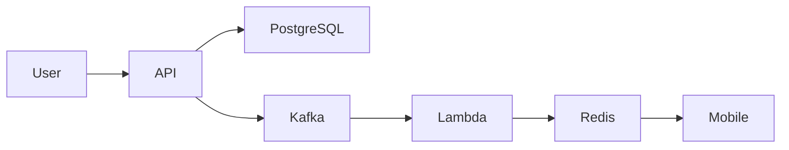

# Module 1 Guided Exercises

## Instructions

Complete these exercises against Transit Signal before consulting the
[answer key](answer-key.md). Reasoning matters more than matching wording.
Record assumptions explicitly. Recommended total time: 4 hours across the four
weeks.

## EX-01: From solution to decision frame

Rewrite:

> We need Kafka and microservices because rider traffic will grow.

Produce:

1. A user/business outcome.
2. A workload assumption with units and horizon.
3. One invariant.
4. One measurable quality scenario.
5. A decision claim with a reversal condition.

## EX-02: Scope, assumption, or constraint

Classify each statement and explain what evidence could change it:

1. The pilot must launch in sixteen weeks.
2. Traffic will grow fivefold.
3. The team wants to use its current language.
4. The existing identity contract runs through next year.
5. Predictive disruption detection is not part of the pilot.
6. Operators never approve from mobile devices.

Identify any statement that could be two categories depending on context.

## EX-03: Workload and sensitivity

A transit authority has 240,000 eligible riders. During a major incident:

- Each rider makes 3 alert checks in a 90-minute period.
- 25% of checks arrive in the busiest 4 minutes.
- 2% of alert views trigger a 1 KiB preference lookup.
- One citywide approval creates delivery work for 600,000 subscriptions.

Calculate:

1. Average alert-view rate during the 90 minutes.
2. Busiest four-minute rate.
3. Preference-lookup rate during the burst.
4. Delivery work if cleared in 10, 30, or 60 minutes.
5. The two inputs whose uncertainty would most affect a first design decision.

## EX-04: Invariant or not

Classify and rewrite weak statements:

1. Alerts should be delivered quickly.
2. A revoked alert is never current for a new rider view.
3. The platform should be secure.
4. At most one authoritative approved version exists for an approval request
   identity.
5. The service should recover from failures.
6. An operator outside the region cannot approve the region’s alert.

For each real invariant, name a threatening operation.

## EX-05: State authority and proof sketch

For current alert version, operator authority, journey route, and delivery
status:

1. Name the authoritative owner.
2. Name allowed writers.
3. Name derived readers.
4. State a repair rule.

Then write a proof sketch for:

> A lost approval response followed by a retry cannot create a second
> authoritative approved version.

Include concurrent approval and recovery replay.

## EX-06: Six-part quality scenarios

Rewrite each requirement in six-part form:

1. Alerts are fast.
2. The system is available during an outage.
3. The platform is secure.
4. Recovery is quick.
5. The system scales during a citywide incident.

For each scenario, include source, stimulus, environment, artifact, response,
measure, population, window, and measurement location. Identify one pair of
targets that could conflict.

## EX-07: Context diagram critique

Critique this view:

Find at least eight problems. Redraw a context view with roles, the system of
interest, external systems, meaningful relationships, and a separate state
ownership table.

## EX-08: Decision drivers and candidates

Create simple, moderate, and distributed Transit Signal candidates. Evaluate
each against:

1. Alert-version authority
2. Rider freshness
3. Slow-channel isolation
4. One-team operation
5. Cost envelope
6. Reversibility

Give every candidate its strongest credible form. Identify one experiment that
could change the ranking.

## EX-09: Reversal conditions

Rewrite these weak reversal statements:

1. Split the service when it gets big.
2. Add regions when global traffic grows.
3. Replace the channel if it is unreliable.
4. Move to a distributed database if performance is bad.

Each result must name a measurement, threshold/window, original decision driver,
and migration seam.

## EX-10: Failure matrix

For each scenario, record fault magnitude and duration, affected journey,
invariant exposure, first finite resource or assumption, expected degradation,
detection, mitigation, recovery, evidence status, and follow-up:

1. Tenfold alert-view burst
2. Notification channel at 20–40 second latency for 15 minutes
3. Rider view 10 minutes behind authoritative version
4. Operator revokes the wrong region’s alert
5. Loss of one hosting zone during peak

Add:

- Two credible combined faults
- One unknown-outcome case
- One excluded fault and why it is excluded

## EX-11: Unsupported claim audit

Classify each claim as Supported, Calculated, Assumed, or Unknown:

1. One application can handle 1,200 reads/second.
2. A separate worker prevents all channel failures from affecting rider reads.
3. The backlog clears within 30 minutes.
4. One current version can be enforced with an expected-version transition.
5. A second zone makes the system highly available.

For each non-supported claim, name the minimum evidence needed before
commitment.

## EX-12: Defense and disagreement

Prepare two-minute responses to:

1. “Why not start with regional services now?”
2. “Your worker shares state with rider reads. What is actually isolated?”
3. “The cost target is an assumption. Why does it influence the decision?”
4. “What happens if a timeout occurs after approval succeeds?”
5. “Which new evidence would make the rejected simple option win?”
6. “Who owns the risk if backlog recovery misses 30 minutes?”

For each response:

- Clarify the question.
- State the applicable assumption or invariant.
- Explain the causal mechanism.
- Cite evidence or state what is missing.
- Name the consequence and follow-up.
