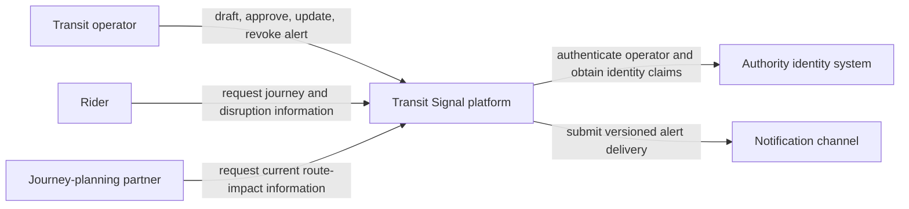
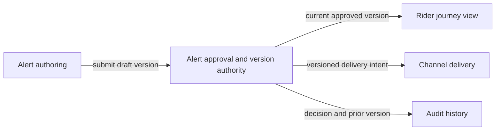

# Context and Boundaries

## Outcomes

After this lesson, you can:

- Draw a system-context diagram that communicates users, external systems,
  responsibilities, and meaningful relationships.
- Separate a domain or trust boundary from a deployable service boundary.
- Add state ownership and trust information without mixing abstraction levels.
- Critique a diagram for ambiguity, missing flow, and false precision.

## Prerequisites

Complete [Lessons 1–4](01-architectural-judgment.md). Review the official C4
system-context guidance in the [resource guide](../resources.md).

## A diagram answers a question

Architecture cannot be captured in one picture. A useful diagram selects a
question and an audience.

A context diagram answers:

> Who uses the system, which external systems interact with it, what crosses the
> boundary, and why?

It does not answer:

- Which classes exist
- Which network port is open
- Which database index supports a query
- Which team deploys each future component

Putting every level on one picture makes the diagram precise-looking and
unreviewable.

## Context first

The official C4 model defines a system-context view around people, the system in
scope, external software systems, and relationships. Module 1 uses that
discipline without requiring a particular diagramming tool.

Include:

- A clear system-of-interest boundary
- Named user roles rather than “user”
- External systems with a reason for interaction
- Directional relationships labeled with intent or information
- Trust or authority changes that matter to the decision
- A title, scope, and concise legend

Exclude internal implementation details unless the decision specifically
requires another view.

## Boundaries have different meanings

Do not use “boundary” as if it always means “microservice.”

### Domain boundary

Separates responsibilities and language. Alert approval and public journey
planning may reason about different state and rules even if implemented in one
process.

### State-ownership boundary

Separates who may accept transitions for a business fact.

### Trust boundary

Marks where identity, authority, data sensitivity, or assumptions change.

### Failure boundary

Describes which work can fail or saturate without taking another journey with
it.

### Deployment boundary

Describes what is released and operated independently.

These boundaries may align. They do not have to. Making them all services before
their drivers are known creates contracts and operations without evidence.

## Use multiple small views

After context, add only the view needed for the next question:

1. **Context view:** people, external systems, relationships.
2. **Responsibility view:** major domain responsibilities and interactions.
3. **State-ownership table:** authoritative facts, writers, readers, repair.
4. **Dynamic view:** one important journey or failure sequence.
5. **Deployment view:** runtime placement, only when deployment is under review.

Review one abstraction at a time.

## Diagram semantics

Every box and arrow should be interpretable without the author in the room.

### Name boxes by responsibility

Prefer “Alert approval” over “Alert Service” when deployment is undecided.

### Label arrows with intent

Prefer “approve version” or “read current route impact” over “HTTPS” at the
context level. Protocol belongs only if it drives the decision.

### Show direction

“Uses” can hide request/response, subscription, replication, or batch transfer.
Show the meaningful direction and label.

### Add state authority outside the picture

Do not overload the diagram. Pair it with a table:

| Fact | Authority | Command source | Derived consumers |
|---|---|---|---|
| Current alert version | Alert approval | Authorized operator | Journey views, notification channels |

## Worked example: Transit Signal

### Context

### Review questions

- Does “notification channel” acknowledge delivery or only acceptance?
- Which system owns route definitions?
- Is journey planning in scope or an external dependency?
- Does the identity system provide authentication only, or regional authority?
- What happens when the channel is unavailable?

The diagram did its job because it generated boundary questions.

### Responsibility view

These are responsibilities, not deployment promises.

## Diagram review checklist

Ask:

1. Is the scope and system of interest obvious?
2. Is every person a role with a distinct need or authority?
3. Is every external system genuinely outside the boundary?
4. Does each relationship say what crosses and why?
5. Are abstraction levels consistent?
6. Are important trust and authority changes visible?
7. Are state owners documented in a paired table?
8. Does the view answer one decision question?
9. Could a reviewer challenge the diagram without the author narrating it?

## Common expert mistakes

### Drawing the desired organization instead of the current decision

Team boxes can bias service boundaries. Record ownership separately until it
drives a deployable choice.

### Using product icons as architecture

Icons show vendor selection but often hide responsibility, state, and flow.

### Treating arrow direction as data consistency

An arrow does not say whether data is authoritative, cached, replayable, stale,
or acknowledged.

### Mixing logical and deployment views

A responsibility may be one module today and a separate process later. Mixing
those questions prevents a clear review.

### Leaving the system boundary implicit

If reviewers cannot agree what is inside the system, requirements and ownership
will drift.

## Guided practice

Complete [EX-07](../exercises/exercises.md#ex-07-context-diagram-critique).
Redraw the flawed transit diagram and write three questions that remain outside
the context view.

## Self-check

1. What question does a system-context diagram answer?
2. Why is a domain boundary not automatically a service?
3. What should an arrow label communicate at context level?
4. When should a deployment view appear?
5. Why pair a diagram with a state-ownership table?

## Explained answers

1. It identifies the system of interest, its users, external systems, and
   meaningful relationships.
2. A domain boundary separates responsibility and language. Independent
   deployment adds compatibility, failure, and operating costs that need their
   own drivers.
3. The intent or information crossing the boundary and its direction, not
   implementation trivia.
4. When runtime placement, failure isolation, scaling, release, or ownership is
   part of the decision.
5. Diagrams communicate relationships well but often obscure which
   responsibility has authority to change each business fact.

## Sources and next work

- Official C4 model (RES-04)
- Creator-led C4 video (RES-05)
- Next: Complete the initial baseline, then study
  [Lesson 6](06-constraints-options-and-reversibility.md).
