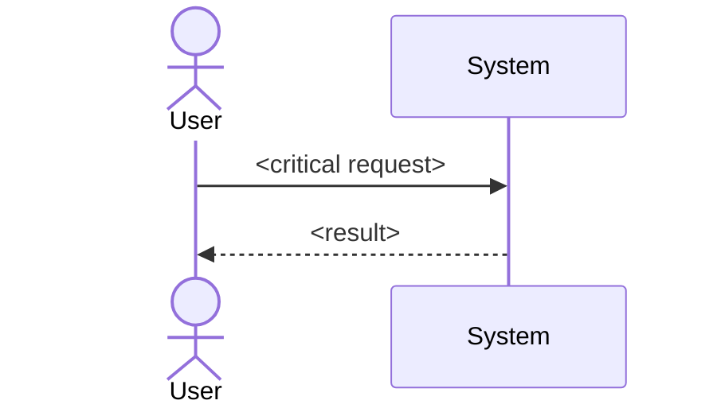

# Week 2: Candidate Designs

## Instructions

Use the frozen Week 1 baseline as input. Do not edit it. This worksheet becomes
`reports/module-01-candidate-designs.md` when completed.

Every candidate must address the same workload, invariants, quality scenarios,
constraints, failure model, cost envelope, and ownership. Describe
responsibilities before naming technologies. Give rejected candidates their
strongest credible form.

## 1. Frozen inputs

- Baseline commit:
- Baseline tag:
- Primary journey:
- Business outcome:
- Planning horizon:

### Top invariants

| ID | Invariant | Why it drives architecture |
|---|---|---|
| | | |

### Top quality scenarios

| ID | Scenario threshold | Why it drives architecture |
|---|---|---|
| | | |

### Constraints and assumptions

| Statement | Type | Confidence/source | Consequence if false |
|---|---|---|---|
| | | | |

## 2. Cost envelope

### Delivery

- Team and skills:
- Calendar:
- Maximum build or migration effort:

### Operations

- On-call and ownership:
- Recovery and degraded-capacity expectation:
- Security/compliance operation:

### Recurring cost

- Unit-cost target:
- Monthly or annual ceiling:
- Status: measured / calculated / assumed / unknown

### Migration

- Maximum compatibility period:
- Required rollback or roll-forward:

## 3. Decision drivers

Rank five to seven drivers. Explain the ranking.

| Rank | Driver | Evidence | Consequence if unmet |
|---:|---|---|---|
| 1 | | | |

## 4. Candidate A: Simple

### Responsibilities and authoritative state

### Critical journey

### Invariant preservation

### Failure and overload behavior

### Security and trust

### Operations and ownership

### Cost and delivery

### Supporting evidence and unknowns

### Migration and reversal

## 5. Candidate B: Moderate

Use the same headings as Candidate A.

### Responsibilities and authoritative state

### Critical journey

### Invariant preservation

### Failure and overload behavior

### Security and trust

### Operations and ownership

### Cost and delivery

### Supporting evidence and unknowns

### Migration and reversal

## 6. Candidate C: Distributed

Use the same headings as Candidate A.

### Responsibilities and authoritative state

### Critical journey

### Invariant preservation

### Failure and overload behavior

### Security and trust

### Operations and ownership

### Cost and delivery

### Supporting evidence and unknowns

### Migration and reversal

## 7. Shared comparison

Qualitative ratings require a causal explanation.

| Driver | Weight | Simple | Moderate | Distributed |
|---|---:|---|---|---|
| | | | | |

### Sensitivity

- Which weight or assumption most changes the ranking?
- Which experiment could cause a different candidate to win?

## 8. Provisional recommendation

Use:

> Given [workload, constraints, and failure model], choose [candidate] because
> [causal mechanisms support prioritized drivers]. Acceptance depends on
> [missing evidence]. Reconsider when [threshold].

## 9. Practice ADR

Select one architecturally significant decision within the candidate and create
`adr/ADR-001-module-01-decision.md` from the ADR template.

## 10. Self-review

- [ ] All candidates use the same inputs and views.
- [ ] No candidate is a straw alternative.
- [ ] State authority is explicit.
- [ ] Failure, security, operations, cost, and ownership are addressed.
- [ ] Assumptions and unknowns are labeled.
- [ ] The recommendation names prerequisite evidence.
- [ ] Reversal includes a measurable trigger and migration seam.
- [ ] AI assistance is disclosed.

## AI assistance disclosure

- Tool:
- Assistance:
- Verification:

