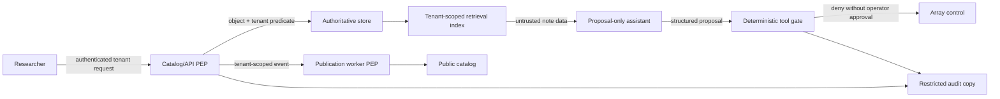

# Northstar Observatory Security and Data Governance

This completed case demonstrates Module 13 reasoning on a non-commerce system.
It is not a canonical architecture. Different controls are defensible when they
preserve the same properties with evidence. Do not transfer Northstar's actors,
thresholds, policies, or topology into the external commerce example.

## Problem and protected outcomes

Northstar coordinates observations for three research consortia. Researchers
upload private observations, collaborate selectively, and request publication.
Operators schedule telescope arrays and approve publication. A public catalog
serves released observations. An assistant retrieves operating notes and can
create a structured proposal, but cannot operate an array.

Protected outcomes:

1. private observations remain within their tenant and explicit collaboration grants;
2. only operators can approve publication or array changes;
3. researcher contact data is used only for account and incident communication;
4. security-relevant actions remain attributable without logging secrets or raw private data;
5. deleted researcher data disappears from active copies and does not return after restore;
6. compromised dependencies, abusive exports, and retrieved instructions cannot cross authority boundaries.

## Assets, actors, and boundaries

| Asset | Property | Owner | Classification/lifecycle |
|---|---|---|---|
| Private observation | Tenant confidentiality, integrity | Consortium data owner | Private until explicit publication |
| Publication decision | Integrity, attribution | Publication operator | Audit retained under approved policy |
| Researcher contact | Purpose limitation, deletion | Identity/privacy owner | Removed after offboarding window |
| Workload credential | Confidentiality, scope, revocation | Platform security | 15-minute lifetime |
| Operating note | Integrity/provenance, untrusted instructions | Operations | Searchable, never authoritative for tools |
| Audit event | Attribution, integrity, minimization | Security operations | Restricted and tamper-detectable |

Actors are researcher, invited collaborator, publication operator, support
engineer, ingest worker, build worker, privacy worker, assistant, dependency
publisher, and external attacker. Support has no default cross-tenant data access.

Trust changes occur at authentication, the API PEP, object/tenant reads,
publication enqueue and execution, retrieval, tool proposals, dependency
admission, audit ingestion, and administrative access.

## Threat model excerpt

| ID | Abuse path | Property | Response and evidence | Residual risk/owner |
|---|---|---|---|---|
| N-T01 | Researcher changes tenant/object ID | Tenant confidentiality | Identity-bound tenant, object PEP, scoped cache/search, negative test, denial event | Offline analytical export pending audit; data owner; expires before launch |
| N-T02 | Observer invokes publish action | Publication integrity | Object/action policy, fresh operator authentication, worker recheck | Emergency manual process; operations owner; quarterly exercise |
| N-T03 | Revoked session replayed | Identity continuity | Server expiry/revocation, negative replay test, session audit | Federated logout delay measured separately; identity owner |
| N-T04 | Exposed worker secret reused | Credential integrity | Short scope, rotation, old-version rejection, attempted-use alert | Consumer rollout delay under 5 minutes; platform owner |
| N-T05 | Privileged actor edits audit record | Attribution | Independent append copy, sequence/hash verification, access audit | Compromised source can emit false events; security owner |
| N-T06 | Deleted contact restored from backup | Data lifecycle | Copy ledger, tombstones, restore replay, query verification | Encrypted backup copy until expiry; privacy owner |
| N-T07 | Unknown decoder artifact deployed | Supply-chain integrity | Digest/provenance expectation, quarantine, last-good rollback | Approved builder compromise; build owner |
| N-T08 | Researcher floods exports | Fair use and cost | Subject/tenant/global work budgets, pre-enqueue denial, unit-cost telemetry | Coordinated multi-account abuse; product/security owner |
| N-T09 | Note instructs array reconfiguration | Tool authority | Untrusted-content label, proposal-only assistant, deterministic tool gate | Model may emit misleading text; assistant owner |

## Identity and session contract

- Researcher viewing: authenticated session, 60-minute overall lifetime,
  server-side expiry and revocation.
- Publication/array decision: operator identity plus authentication no more than
  five minutes old.
- Recovery: registered second channel, notification, delay, old-recovery
  invalidation, session revocation, and audit.
- Workloads: 15-minute tenant- and operation-scoped credentials; no shared static secret.

F03 proves the server rejects a revoked 90-minute session before object access.
Northstar does not claim global federation logout until every accepting boundary
has timed evidence.

## Authorization and isolation

Northstar combines roles with attributes and relationships:

| Subject/context | Object/action | Decision |
|---|---|---|
| Researcher in tenant A | Read owned private observation in A | Allow |
| Researcher in tenant A | Read private observation in B | Deny without confirming existence |
| Live collaborator grant | Read named observation | Allow until relationship expiry |
| Researcher | Approve publication | Deny |
| Operator with fresh auth | Approve eligible publication | Allow and recheck at worker |
| Assistant | Read tenant-scoped operating note | Allow |
| Assistant or note text | Reconfigure array | Deny; only structured proposal allowed |

Tenant identity comes from verified membership. Database predicates, cache keys,
file namespaces, messages, indexes, exports, and audit views include tenant.
Search filters before ranking. Break glass requires incident ID, approver,
specific tenant/action, 15-minute expiry, visible warning, alert, and review.

## Credential and key lifecycle

The ingest worker credential is issued to its workload identity with one tenant
and `feeds:write`. Version 3 overlaps version 2 only while consumers prove version
3 acceptance. Issuance switches, attempts with version 2 are denied and alerted,
and version 2 is removed from consumers. Rollback never reauthorizes an exposed value.

Northstar uses reviewed channel and storage encryption. Its threat model states
that authorized processes see plaintext, keys do not authorize tenant access,
and key destruction requires recovery and retention review.

## Audit and privacy lifecycle

The publication audit event contains event ID, actor/workload identity, tenant,
safe object ID, action, outcome, policy version, PEP, timestamp, and correlation.
It excludes session secrets, credentials, note bodies, and observation contents.
Independent sequence verification detects deletion or modification; logging
failure alerts and fails closed for high-risk changes.

Researcher contact deletion:

1. mark the authoritative identity inactive and revoke sessions;
2. remove contact data from active store, cache, search, exports, and notification queues;
3. retain a non-sensitive tombstone and audit identity required for proof;
4. record backup exception, access, and expiry;
5. replay deletion tombstones before a restored environment serves requests;
6. run normal and direct-copy queries and record zero active matches.

The privacy owner supplies the approved retention and exception policy. The
architecture does not infer legal duties from the technical framework.

## Dependency, abuse, and tool controls

Northstar accepts a decoder only when source, revision, digest, builder, and
provenance match expectations. A valid signature from an unapproved builder is
denied. Quarantine retains the last approved artifact and opens an investigation.

Exports are budgeted by bytes scanned and worker-seconds per subject, tenant,
and system. Optional work is denied before enqueue. Operator, incident, and
deletion work reserve capacity.

The assistant receives untrusted retrieved text and read-only credentials. A
tool proposal is typed, bounded, tenant-bound, authorized, budgeted, and audited.
Array changes require exact human approval, fresh operator authentication, and
idempotency. Northstar currently chooses proposal-only behavior because observed
operator volume does not justify bounded tool execution risk and ownership cost.

## Failure evidence summary

All nine broken trials fail their named invariant. Each repaired trial differs
only in one named control and restores I01-I12. Shared-input hashes prove the
adversarial stimulus did not change between variants. The evidence demonstrates
the reference model's decision contract, not production security.

## Alternatives and reversal conditions

Northstar rejected RBAC-only because temporary per-observation collaboration
would cause role explosion. It did not adopt a separate global authorization
service because current scale and ownership do not justify migration and outage
cost; a shared policy library with centralized tests is sufficient. Reconsider
when three independently deployed systems need the same relationship policy or
policy-change inconsistency exceeds the declared limit.

For tenant isolation, shared storage with layered predicates and policy is
selected. Reconsider dedicated resources for tenants whose residency, key
custody, blast-radius, or contract cannot be met in the shared tier. For the
assistant, reconsider bounded operator tools only after demand, approval latency,
incident response, and adversarial tests meet published thresholds.

## Teaching notes

Alternative authorization, isolation, audit, credential, and assistant designs
can score highly when they preserve the properties with causal evidence. The
lesson is not to copy Northstar. It is to expose authority, failure, evidence,
cost, and ownership well enough that a reviewer can challenge the decision.
